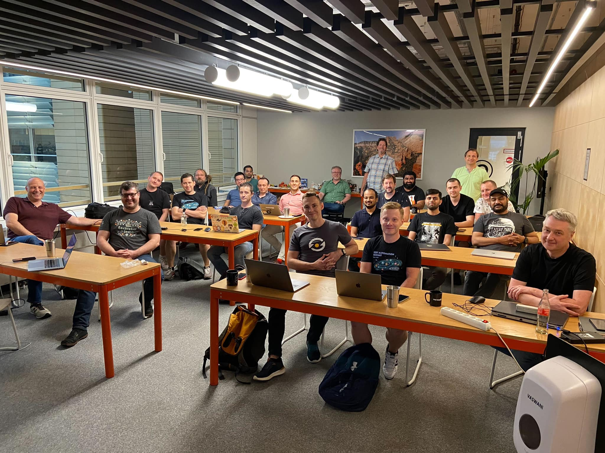

When Titus Fortner ([@titusfortner](https://twitter.com/titusfortner)), the maintainer of [Watir](https://www.selenium.dev/blog/2022/test-automation-summit/) and a contributor to [Selenium](https://www.selenium.dev/), messaged me on Twitter two months ago, I knew something interesting was coming.

Titus and I never met in person. In fact, I have never met most of the other open-source maintainers I've worked with over the last ten years since I became an open-source maintainer myself and the last six years I spent working on [Serenity/JS](https://serenity-js.org).

This is not that surprising, to be fair. After all, have you ever met any of the people maintaining the open-source libraries and frameworks that _your work_ depends on?

Well, in my case, this was about to change.

What Titus had in mind was what became the very first [Test Automation Summit](https://www.selenium.dev/blog/2022/test-automation-summit/) - a way to help the maintainers of all the various free open-source projects facilitating web-based testing to connect better and collaborate more effectively.

As you might have expected, as soon as I heard _test automation_, _collaboration_ and _open source_ all in one sentence, I immediately said "yes!" 

It wasn't going to be yet another Zoom call or a meetup at the local pub.
No. On the contrary, what Titus envisioned was a number of working sessions over the course of several days where the open-source maintainers and representatives of the development teams behind the major web browsers look into answering several important questions:
- **How can we make it easier for developers to get into test automation**, and more importantly - **how can we help them do it well?** Test automation is a complex and ever-evolving domain and, let's face it, not the primary focus of most developers trying to get their product features shipped under tight deadlines. Even worse, there is plenty of poor advice on the Internet and many companies selling [snake oil](https://en.wikipedia.org/wiki/Snake_oil) and commercial tools that promote bad practices.
- **How can we make it easier for open-source projects to onboard contributors and maintainers?** Maintaining free open-source software is _much_ more work than most developers imagine and typically requires **10-40 hours per week per maintainer** **_on top_** of our regular day jobs. To put things in perspective, there are [**83 million developers**](https://en.wikipedia.org/wiki/GitHub) registered on GitHub, and **less than 100 core maintainers** who support the major test automation tools most of us rely on every day to get our work done. And I didn't miss a zero or few there, I'm afraid, **less than one hundred**.
- So given the limited resources, **how can we be more effective as a test automation community?** Many open-source automation tools provide similar or overlapping features, and the documentation we provide to the users is vast and often challenging for newcomers to navigate. Those issues often confuse the users trying to pick the "right tool for the job". They also make beginners gravitate towards the "batteries included" commercial tools, which are technologically inferior and typically result in increased maintenance costs but tend to offer a better user experience, polished marketing, and require fewer choices and less experience.  
- And lastly, **what can the browsers do to make testing web applications easier?** Over the last decade, web applications have become increasingly complex and steadily replaced the more traditional desktop-based applications. web browsers have also become more sophisticated than ever, and it's often easier to think of them as _operating systems_ than just something that "renders a page". Even though all popular browsers nowadays provide drivers supporting the [WebDriver protocol](https://www.w3.org/TR/webdriver2/), Chromium-based browsers also support the [Chrome DevTools protocol](https://chromedevtools.github.io/devtools-protocol/). This new protocol offers greater browser control but is also much more chatty and impractical when used with remote test grids (which you'd use for cross-browser and native mobile testing). So how can we have both **greater control** _and_ **greater versatility**?

Apart from trying to find answers to those questions, we also had an opportunity to present the open-source projects we are working on. In the many conversations we had with other maintainers, we also shared the challenges we face and the ways we have found to overcome them.

Those challenges ranged from **technical challenges** of running a software project: How do you keep dependencies up to date? What security checks do you have in place? How do you protect your users from breaking changes? What's your PR process like? 

Through **legal challenges**: How do you protect your intellectual property and brand? How do you protect the rights of your contributors? How do you keep your community safe and inclusive? 

All the way to **challenges with funding**: How do you fund your project? How do you find sponsors? How do you make your project sustainable? Is selling your work to one of the "big players" the only way to go?

Over those couple of days in Berlin, I had the great pleasure of learning from and exchanging ideas with the leaders of some of the most successful free open-source test automation projects.

Watch this space 😎

Jan

_Huge thanks to the [Software Freedom Conservancy](https://sfconservancy.org/) for sponsoring my travel to the event and to [SauceLabs](https://saucelabs.com/) for sponsoring the office space in Berlin!_
